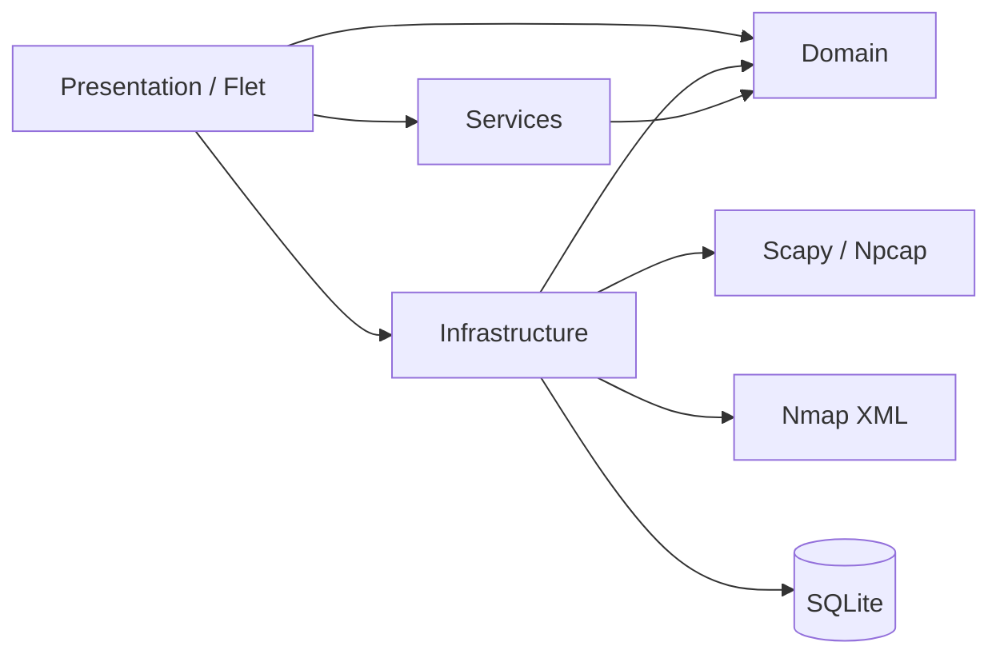

# NetPulse

NetPulse es una aplicación de escritorio para supervisar redes en
Windows. Combina captura pasiva de tráfico con **Scapy/Npcap** y análisis activo
con **Nmap** para ofrecer una vista unificada de dispositivos, conexiones,
protocolos, puertos, servicios, riesgos y cambios en la red.

La interfaz nativa está construida con Flet Desktop, actualiza la telemetría
cada 200 ms y se adapta al tamaño y al escalado DPI de la ventana de Windows.

> Use las funciones de captura y escaneo únicamente en redes y dispositivos
> propios o para los que tenga autorización expresa.

## Contenido

- [Funciones principales](#funciones-principales)
- [Requisitos](#requisitos)
- [Instalación](#instalación)
- [Uso en escritorio](#uso-en-escritorio)
- [Guía de la interfaz](#guía-de-la-interfaz)
- [Escaneos Nmap](#escaneos-nmap)
- [Diagnóstico, inventario y automatización](#diagnóstico-inventario-y-automatización)
- [Datos y privacidad](#datos-y-privacidad)
- [Arquitectura](#arquitectura)
- [Estructura del proyecto](#estructura-del-proyecto)
- [Pruebas](#pruebas)
- [Solución de problemas](#solución-de-problemas)

## Funciones principales

### Monitoreo en tiempo real

- Captura de tráfico entrante y saliente mediante Scapy y Npcap.
- Velocidad de descarga, subida y paquetes por segundo.
- Actualización visual cada `0.2` segundos.
- Clasificación de protocolos TCP, UDP, HTTP, HTTPS, DNS, ICMP y otros.
- Tabla de paquetes recientes con filtros por protocolo, dirección e IP.
- Exportación de los paquetes visibles a CSV.
- Gráficos de ancho de banda y distribución acumulada por protocolo.
- Asociación aproximada de puertos con procesos locales mediante psutil.
- Alertas configurables por ancho de banda y paquetes por segundo.

### Inventario y análisis de red

- Descubrimiento de dispositivos conectados con Nmap.
- Identificación de IP, hostname, MAC, fabricante y posible sistema operativo.
- Detección de puertos abiertos, protocolos, productos y versiones.
- Seis perfiles de escaneo, desde descubrimiento rápido hasta scripts NSE.
- Análisis simultáneo de múltiples IP, hostnames o redes CIDR.
- Indicadores de riesgo por dispositivo y para el escaneo completo.
- Alertas sobre servicios expuestos o potencialmente peligrosos.
- Detección de dispositivos, puertos y servicios nuevos, cerrados o cambiados.
- Centro de diagnóstico con prioridad, explicación del riesgo, evidencia y
  acciones recomendadas.
- Verificación automática de servicios expuestos que quedaron resueltos en el
  análisis siguiente.
- Mapa de red agrupado por segmentos `/24`, con identificación del equipo
  local, router probable, riesgo y confianza de cada nodo.
- Inventario persistente editable con nombre, tipo, propietario, ubicación,
  notas y estado de confianza.
- Comparación visual entre análisis consecutivos con equipos nuevos o ausentes,
  cambios de IP por MAC, puertos abiertos/cerrados y variación del riesgo.
- Explicación interactiva de servicios expuestos con motivo, recomendación y
  comando acotado de verificación.
- Informes PDF, HTML y CSV con resumen ejecutivo, inventario, riesgos,
  evidencias y recomendaciones.
- Búsqueda global por IP, MAC, hostname, propietario, proceso, aplicación,
  puerto, servicio o endpoint histórico.
- Perfiles personalizados para guardar grupos de redes y métodos de análisis.
- Escaneos recurrentes persistentes con intervalos configurables, estado de
  ejecución y opción de notificar únicamente cambios relevantes.
- Notificaciones dentro del escritorio para dispositivos nuevos, puertos
  sensibles, cambios importantes, fallos programados y umbrales de tráfico.

Los escaneos programados se ejecutan mientras NetPulse permanece abierto. La
agenda y su próxima ejecución se conservan en SQLite entre reinicios.
- Puntuación explicable de salud de `0` a `100`, con cada descuento detallado
  por servicios expuestos, confianza, cambios, scripts NSE y cobertura.
- Historial de escaneos consultable desde la interfaz.
- Registro del método, comando, versión de Nmap y duración del análisis.

### Historial y persistencia

- Sesiones de captura almacenadas en SQLite.
- Resúmenes de tráfico por segundo.
- Principales IP y conexiones de cada sesión.
- Resultados Nmap normalizados por escaneo, dispositivo, servicio y alerta.
- Enriquecimiento asíncrono de IP con DNS inverso, país y ASN.

## Requisitos

| Componente | Requisito | Uso |
|---|---|---|
| Sistema operativo | Windows 10 u 11 | Plataforma actualmente soportada |
| Python | 3.10 o superior | Ejecución de la aplicación |
| Npcap | Versión reciente | Captura pasiva de paquetes |
| Nmap | Versión reciente | Descubrimiento y análisis activo |
| Permisos | Administrador recomendado | Acceso completo a captura y escaneos avanzados |
| Internet | Opcional | Geolocalización de IP y prueba integral de captura |

Descargas oficiales:

- [Python para Windows](https://www.python.org/downloads/windows/)
- [Npcap](https://npcap.com/)
- [Nmap](https://nmap.org/download.html)

Durante la instalación de Npcap es recomendable habilitar su modo compatible
con WinPcap. Nmap suele instalar Npcap, pero conviene comprobar ambos
componentes por separado.

## Instalación

Clone el repositorio y abra su carpeta desde PowerShell:

```powershell
git clone https://github.com/Carlos-Dev-Lab/NetPulse.git
cd NetPulse
```

### Instalación automática

El lanzador crea `.venv`, instala las dependencias y solicita elevación cuando
es necesario:

```powershell
.\scripts\start.bat
```

### Instalación manual

```powershell
python -m venv .venv
.\.venv\Scripts\python.exe -m pip install --upgrade pip
.\.venv\Scripts\python.exe -m pip install -r requirements.txt
```

Activar el entorno es opcional. Si desea hacerlo:

```powershell
.\.venv\Scripts\Activate.ps1
```

Comprobar que Nmap está disponible:

```powershell
nmap --version
```

Si PowerShell no encuentra el comando, reinicie la terminal después de instalar
Nmap o confirme que `nmap.exe` está en `PATH`. NetPulse también busca las rutas
predeterminadas `C:\Program Files\Nmap` y `C:\Program Files (x86)\Nmap`.

## Uso en escritorio

Ejecute:

```powershell
.\.venv\Scripts\python.exe -m netpulse
```

También puede usar el lanzador, que solicita permisos de administrador:

```powershell
.\scripts\start.bat
```

### Flujo recomendado

1. Abra **Settings** y seleccione la interfaz de red. `All interfaces` funciona
   como opción general, pero elegir la interfaz activa produce resultados más
   precisos.
2. Regrese al **Dashboard** y pulse **START** para iniciar la captura.
3. Revise velocidades, protocolos, conexiones y paquetes en tiempo real.
4. Abra **Network** para ejecutar un análisis Nmap independiente de la captura.
5. Pulse **STOP** antes de cerrar para completar correctamente la sesión.
6. Consulte **History** para revisar las sesiones guardadas.

La ventana tiene un tamaño inicial de `1080 x 660`, un mínimo de `900 x 620` y
redistribuye tarjetas, gráficos y paneles al cambiar sus dimensiones.

## Guía de la interfaz

### Dashboard

Vista general de la sesión activa:

- tráfico total recibido y enviado;
- paquetes procesados y tiempo de sesión;
- velocidad actual y valores máximos;
- uso de CPU y memoria del equipo;
- gráfico de tráfico entrante y saliente;
- distribución por protocolos;
- principales conexiones remotas;
- flujo resumido de paquetes recientes.

El botón **START/STOP** del encabezado controla la captura. El estado y la
interfaz activa también aparecen en la barra superior.

### Network

Centro de descubrimiento activo con Nmap:

1. Introduzca una o varias IP, hostnames o redes CIDR. Separe varios objetivos
   con comas, espacios o saltos de línea, por ejemplo
   `172.26.4.0/24, 172.26.3.0/24`.
2. Seleccione el método de escaneo.
3. Pulse **SCAN NETWORK**.
4. Espere a que termine. El trabajo se ejecuta fuera del hilo visual para que
   la interfaz siga respondiendo.
5. Revise dispositivos, puertos, servicios, riesgo, alertas y cambios.

El objetivo inicial se obtiene de la interfaz activa. Si la red detectada es
muy amplia, NetPulse limita la sugerencia inicial a una subred `/24` para evitar
un escaneo accidentalmente extenso.

El selector **Scan history** permite abrir resultados anteriores. Los cambios
se calculan comparando el nuevo resultado con el último escaneo del mismo
objetivo.

## Diagnóstico, inventario y automatización

Después de un análisis, la vista **Network** ofrece un flujo completo:

1. **Salud de la red** muestra una puntuación de `0` a `100`. El acordeón de
   detalle enumera cada descuento y su evidencia; no es una valoración opaca.
2. **Antes vs. ahora** compara el resultado con el análisis anterior del mismo
   objetivo: equipos nuevos o ausentes, cambios de IP por MAC, puertos
   abiertos/cerrados y variación del riesgo.
3. **Centro de diagnóstico** ordena los problemas por IP y explica prioridad,
   motivo, acción recomendada, evidencia y controles que quedaron resueltos.
4. **Mapa de red** agrupa los nodos por segmento `/24`, identifica el equipo
   local y el router probable, y colorea cada nodo por riesgo y confianza.
5. **Dispositivos y servicios** permite seleccionar una IP para filtrar sus
   alertas. Al pulsar un puerto se abre su explicación y una verificación Nmap
   acotada.

El inventario se actualiza automáticamente sin sobrescribir los campos
manuales. El botón de edición de cada dispositivo permite guardar:

- nombre personalizado y tipo de dispositivo;
- propietario y ubicación;
- notas operativas;
- confianza: `new`, `known`, `authorized` o `blocked`.

La búsqueda global admite IP, MAC, hostname, alias, propietario, ubicación,
puerto, servicio, producto, versión, endpoint histórico y procesos observados.

### Informes

Seleccione un análisis del historial y pulse **EXPORT REPORT**. NetPulse crea
en `exports/` tres archivos con el mismo identificador y fecha:

- PDF listo para compartir, con resumen, salud, inventario y recomendaciones;
- HTML consultable o imprimible;
- CSV con una fila por dispositivo y servicio, compatible con Excel.

### Perfiles y escaneos programados

En **Profiles and schedules** puede guardar un nombre para el objetivo y método
actual, recuperarlo después y crear una ejecución cada 15 o 30 minutos, 1, 6 o
24 horas. Cada programación puede notificar siempre o solamente cuando haya
cambios relevantes.

La agenda se conserva en SQLite, pero se ejecuta únicamente mientras NetPulse
está abierto. Los análisis automáticos usan el mismo historial, diagnóstico,
inventario y límites de seguridad que los manuales.

### Packets

Muestra los paquetes recientes de la sesión:

- hora, dirección, protocolo, IP de origen y destino;
- puerto, tamaño y datos geográficos disponibles;
- filtros por protocolo, dirección e IP;
- pausa visual del listado sin detener la captura;
- exportación CSV mediante **Export CSV**.

Los CSV se crean en el directorio desde el que se inició la aplicación con un
nombre como `netpulse_export_20260611_120000.csv`.

### Charts

Presenta indicadores de descarga, subida y paquetes por segundo, además de:

- picos de velocidad de la sesión;
- evolución temporal del ancho de banda;
- distribución acumulada de paquetes por protocolo.

### History

Permite seleccionar una sesión de captura guardada y consultar:

- estado y fecha de la sesión;
- interfaz utilizada;
- paquetes y volumen total;
- tráfico histórico por segundo;
- principales IP, bytes, paquetes y última actividad.

Este historial corresponde a captura pasiva. El historial de Nmap se consulta
desde la vista **Network**.

### Processes

Relaciona conexiones observadas con procesos locales usando la información de
puertos proporcionada por psutil. La atribución es aproximada: conexiones muy
breves, procesos protegidos o cambios rápidos de puerto pueden no identificarse.

### Settings

Incluye:

- selección de la interfaz de captura;
- umbral de ancho de banda en KB/s;
- umbral de paquetes por segundo;
- información sobre la base SQLite y requisitos del sistema.

Los cambios de interfaz se aplican al iniciar la siguiente captura. Los
umbrales de alerta se mantienen en memoria durante la ejecución actual y `0`
los desactiva.

## Escaneos Nmap

| Perfil | Alcance | Uso recomendado | Timeout máximo |
|---|---|---|---:|
| Device discovery | Descubrimiento sin sondeo de puertos (`-sn`) | Inventario rápido de equipos activos | 120 s |
| Global discovery | Exploracion de rangos grandes por bloques `/24`, sin puertos | Mapear una red completa como `/16` | Variable por bloques |
| Quick ports | Discovery previo y 50 puertos TCP solo en hosts vivos | Comprobacion cotidiana de una subred | 240 s |
| Service inventory | Discovery previo, 300 puertos TCP y versiones detalladas | Inventario de servicios | 900 s |
| Deep audit | Puertos, versiones, SO y scripts `default,safe` | Auditoria autorizada mas completa | 1.800 s |
| Vulnerability audit | Versiones y scripts NSE `vuln` | Investigacion controlada de riesgos | 2.400 s |

Para rangos grandes como `/16`, use **Global discovery**. Los perfiles de
puertos (`Quick ports`, `Service inventory`, `Deep audit` y `Vulnerability
audit`) estan pensados para rangos acotados; si reciben una red demasiado
grande, NetPulse avisa al instante y sugiere la subred `/24` local.

Los perfiles avanzados pueden generar más tráfico, tardar varios minutos y
requerir permisos elevados. La detección de sistema operativo no siempre es
concluyente y depende de las respuestas disponibles en el objetivo.

### Interpretación del riesgo

NetPulse asigna indicadores `LOW`, `MEDIUM` o `HIGH` a partir de:

- puertos y servicios expuestos;
- protocolos inseguros como Telnet;
- bases de datos o servicios administrativos accesibles directamente;
- resultados relevantes de scripts NSE;
- cantidad de hallazgos importantes en un mismo dispositivo.

El nivel es una ayuda para priorizar la revisión, no una confirmación automática
de vulnerabilidad. Los resultados deben validarse antes de tomar acciones.

### Cambios entre escaneos

Para el mismo objetivo se detectan:

- dispositivos nuevos o desaparecidos;
- puertos abiertos recientemente;
- puertos que dejaron de estar disponibles;
- cambios en el producto, versión o información adicional de un servicio.

## Datos y privacidad

La base se crea automáticamente en:

```text
data/netpulse.db
```

NetPulse persiste:

- inicio, cierre, interfaz y totales de cada sesión;
- resúmenes agregados de tráfico aproximadamente una vez por segundo;
- IP principales y sus contadores acumulados;
- metadatos de escaneos Nmap;
- dispositivos, servicios, riesgo, alertas y cambios detectados.

NetPulse **no guarda el contenido completo de los paquetes**. Los paquetes
recientes se mantienen temporalmente en memoria para alimentar la interfaz.

El enriquecimiento de IP puede enviar la IP consultada a `ip-api.com`. Esta
función necesita Internet y está sujeta a disponibilidad y límites del servicio.

## Arquitectura

El proyecto sigue una separación por responsabilidades:



### Capas

- `domain`: modelos y reglas de agregación sin dependencias de Flet, Scapy,
  Nmap o SQLite.
- `infrastructure`: captura de paquetes, ejecución segura de Nmap, parseo XML y
  persistencia.
- `services`: resolución DNS y enriquecimiento geográfico asíncrono.
- `presentation`: composición de dependencias, navegación, eventos, vistas,
  gráficos y adaptación a ventanas de escritorio.

La captura pasiva y el escaneo activo son flujos independientes. Scapy alimenta
el estado en tiempo real, mientras Nmap genera instantáneas persistentes que se
pueden comparar. Las tareas lentas se ejecutan fuera del hilo de interfaz.

Las decisiones detalladas están en
[`docs/ARCHITECTURE.md`](docs/ARCHITECTURE.md).

## Estructura del proyecto

```text
network_analyzer/
├── netpulse/
│   ├── __main__.py                 Punto de entrada: python -m netpulse
│   ├── config.py                   Rutas y directorios de ejecución
│   ├── domain/
│   │   ├── models.py               Modelo de paquete capturado
│   │   ├── state.py                Agregación y estado en tiempo real
│   │   └── network_scan.py         Escaneos, hosts, servicios y hallazgos
│   ├── infrastructure/
│   │   ├── sniffer.py              Captura Scapy/Npcap y procesos
│   │   ├── nmap_scanner.py         Perfiles, ejecución, XML, riesgo y cambios
│   │   └── database.py             Esquema y consultas SQLite
│   ├── services/
│   │   └── ip_info.py              DNS inverso, país y ASN
│   └── presentation/
│       ├── app.py                  Composición y ciclo de actualización
│       ├── views.py                Vistas de escritorio adaptables
│       ├── charts.py               Gráficos personalizados
│       └── theme.py                Colores y tema Flet
├── data/
│   └── netpulse.db                 Base creada durante la ejecución
├── docs/
│   └── ARCHITECTURE.md             Decisiones arquitectónicas
├── scripts/
│   ├── start.bat                   Instalación y arranque asistido
│   └── system_check.py             Diagnóstico integral
├── tests/
│   ├── test_database.py            Persistencia de sesiones
│   ├── test_nmap.py                XML, riesgo, cambios e historial Nmap
│   ├── test_state.py               Agregación de tráfico
│   └── test_system.py              Dependencias y componentes Flet
├── requirements.txt
└── README.md
```

## Dependencias Python

Definidas en `requirements.txt`:

| Paquete | Función |
|---|---|
| `flet` | Interfaz y composición de la aplicación |
| `flet-desktop` | Cliente nativo de escritorio |
| `scapy` | Captura y decodificación de paquetes |
| `psutil` | Interfaces, sistema y asociación con procesos |

Nmap, Npcap y SQLite no se instalan mediante `pip`. SQLite forma parte de la
biblioteca estándar de Python; Nmap y Npcap son dependencias externas del
sistema operativo.

## Pruebas

### Suite automatizada

```powershell
.\.venv\Scripts\python.exe -W error::DeprecationWarning -m unittest discover -v
```

### Comprobación de sintaxis

```powershell
.\.venv\Scripts\python.exe -m compileall -q netpulse tests scripts
```

### Diagnóstico integral

```powershell
.\.venv\Scripts\python.exe scripts\system_check.py
```

El diagnóstico verifica:

- versiones e imports principales;
- pruebas unitarias y construcción de componentes Flet;
- estabilidad del ciclo de actualización de 200 ms;
- disponibilidad de Nmap y descubrimiento real de localhost;
- captura Npcap real mediante una solicitud HTTPS;
- protocolos, direcciones y cantidad de paquetes observados.

Una ejecución correcta termina con:

```text
SYSTEM_CHECK_OK
```

## Solución de problemas

### Npcap no está instalado o no se capturan paquetes

1. Instale Npcap.
2. Reinicie Windows si la instalación acaba de realizarse.
3. Ejecute NetPulse como administrador.
4. Seleccione la interfaz activa en **Settings**.
5. Compruebe que la interfaz tenga conectividad y genere tráfico.

### Nmap no fue encontrado

```powershell
& "C:\Program Files (x86)\Nmap\nmap.exe" --version
```

Si esa ruta no existe, revise `C:\Program Files\Nmap` o reinstale Nmap. Cierre y
abra PowerShell para actualizar `PATH`.

### Un escaneo no encuentra dispositivos

- Pruebe primero **Device discovery** sobre la subred correcta.
- Algunos equipos bloquean ICMP o sondas de descubrimiento.
- Compruebe VPN, firewall, aislamiento Wi-Fi y máscara de red.
- Ejecute con permisos de administrador para perfiles avanzados.
- Reduzca el objetivo a una subred concreta, por ejemplo `192.168.1.0/24`.

### La interfaz parece detenida

- Confirme que el encabezado muestre `CAPTURING`.
- Genere tráfico abriendo un sitio web o realizando una descarga.
- La pausa en **Packets** congela solo la tabla, no toda la captura.
- Un escaneo Nmap puede tardar, pero el indicador de progreso debe continuar
  visible y las demás vistas deben seguir respondiendo.

### PowerShell bloquea `Activate.ps1`

No es necesario activar el entorno. Ejecute directamente:

```powershell
.\.venv\Scripts\python.exe -m netpulse
```

### La geolocalización tarda o no aparece

La resolución se realiza en segundo plano y depende de DNS, conectividad,
disponibilidad de `ip-api.com` y sus límites de uso. La captura continúa aunque
el enriquecimiento no responda.

## Estado de validación

El proyecto se ha comprobado con Python 3.12, Flet 0.85.3, Scapy 2.7.0,
psutil 7.2.2, Nmap 7.99 y Npcap en Windows. La validación incluye interfaz de
escritorio, captura real, escaneo Nmap, persistencia y pruebas
automatizadas.
